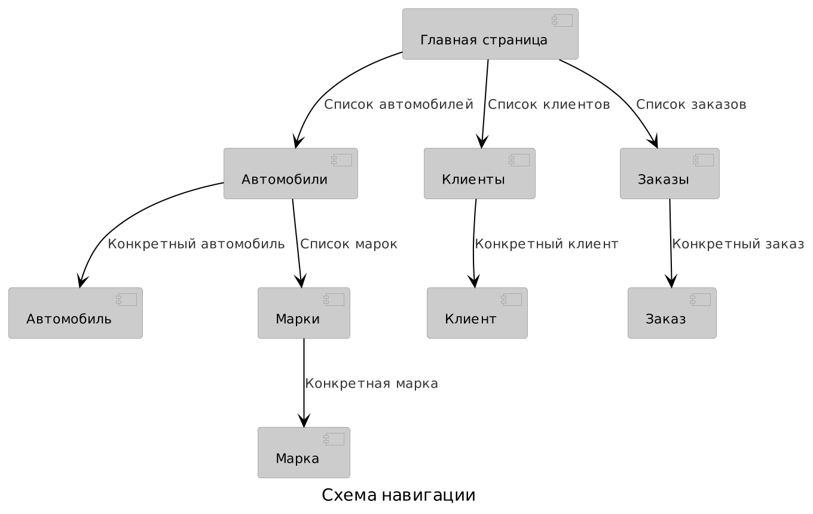

# Автосалон.

## Описание страниц

### Главная страница
Содержит краткую информацию и ссылки на содержательные страницы

### Автомобили
1. Добавить конкретный автомобиль или марку
2. Список всех автомобилей
3. Поиск по категориям

### Автомобиль
1. Прочитать подробную инфомацию о конкретном автомобиле
2. Отредактировать данные
3. Сохранить изменения

### Марки
1. Список марок
2. Добавить марку

### Марка
1. Информация о марке
2. Удалить марку

### Клиенты
1. Список клиентов
2. Добавить клиента
3. Удалить клиента
4. Посмотреть подробную информацию о клиенте
5. Поиск клиента

### Клиент
1. Информация о клиенте
2. Редактировать данные
3. Сохранить изменения

### Заказы
1. Список всех заказов
2. Оформить заказ
3. Изменить статус заказа

### Заказ
1. Информация о заказе
2. Выбор статуса заказа
3. Сохранить изменения

## Схема БД

## Сценарии использования
### Получение списка автомобилей по разным характеристикам
	Главная станица -> Автомобили ->
	-> ввести категории в поле категорий ->
	-> нажать на кнопку "поиск"
### Получение списка клиентов по характеристикам их заказов
	Главная страница -> Клиенты ->
	-> ввести категории в поле категорий ->
	-> нажать на кнопку "поиск"
### Оформление заказа
	Главная страница -> Заказы -> Оформить заказ -> Заполнить поля
	-> нажать на кнопку "отправить" -> Получить номер заказа
### Проверка статуса заказа
	Главная страница -> Заказы -> Ввести номер заказа в поле поиска ->
	-> нажать на кнопку "поиск"
### Изменение статуса заказа
	Главная страница -> Заказы -> Ввести номер заказа в поле поиска ->
	-> нажать на кнопку "поиск" -> Нажать на кнопку "изменить" ->
	-> Отредактировать поля -> нажать на кнопку "Сохранить"

### Добавление клиентов
	Главная страница -> Клиенты -> кнопка "Добавить"
### Удаление клиентов
	Главная страница -> Клиенты -> Поиск ->
	На строчке с искомым клиентом нажать на кнопку "подробнее" ->
	-> Нажать на кнопку "удалить"
### Чтение данных
	Главная страница -> Клиенты -> Поиск ->
	На строчке с искомым клиентом нажать на кнопку "подробнее"
### Редактирование данных
	Главная страница -> Клиенты -> Поиск ->
	На строчке с искомым клиентом нажать на кнопку "редактировать" ->
	заполнить поля -> нажать на кнопку "отправить"

### Добавить марку автомобиля
	Главная страница -> Автомобили -> Марки -> Добавить марку ->
	-> Заполнить данные -> нажать на кнопку "отправить"
### Удалить марку
	Главная страница -> Автомобили -> Марки ->
	На строчке с искомой маркой нажать на кнопку "удалить"
### Добавить автомобиль
	Главная страница -> Автомобили -> Добавить автомобиль ->
	-> Заполнить данные -> нажать на кнопку "отправить"
### Чтение данных об автомобиле
	Главная страница -> Автомобили -> Поиск ->
	На строчке с искомым автомобилем нажать на кнопку "подробнее"
### Редактирование данных
	Главная страница -> Автомобили -> Поиск ->
	На строчке с искомым автомобилем нажать на кнопку "редактировать" ->
	заполнить поля -> нажать на кнопку "отправить"
