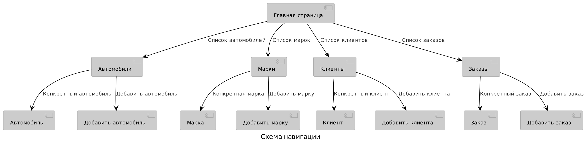

# Автосалон.

## Сборка
Сборка проекта производится с помощью системы gradle.

Запуск:
```
./gradlew bootRun
```
Тесты:
```
./gradlew check
```

## Описание страниц

### Навигация
Схема навигации показана на рисунке. Навигация по спискам "Автомобили",
"Клиенты", "Заказы" и "Марки" доступна по заголовку на любой странице.



### Главная страница
Содержит краткую информацию и ссылки на содержательные страницы

### Автомобили
1. Добавить конкретный автомобиль.
2. Список всех автомобилей.
3. Поиск по категориям. Посмотреть результаты поиска.
4. Удалить автомобиль из таблицы.

### Автомобиль
1. Прочитать подробную инфомацию о конкретном автомобиле.
2. Отредактировать данные.
3. Сохранить изменения.
4. Удалить автомобиль.

### Марки
1. Список марок.
2. Перейти к добавлению марки.
2. Удалить марку.

### Марка
1. Информация о марке.
2. Редактировать информацию о марке.
3. Сохранить информацию.
4. Удалить марку.

### Клиенты
1. Список клиентов.
2. Перейти к добавлению клиента.
3. Удалить клиента.
4. Перейти к редактированию данных клиента.
5. Поиск клиентов. Смореть результаты поиска.

### Клиент
1. Подробная информация о клиенте.
2. Редактировать данные.
3. Сохранить изменения.
4. Удалить клиента.

### Заказы
1. Список всех заказов.
2. Перейти к оформлению нового заказа.
3. Перейти к редактированию заказа из списка.
4. Удаление заказов.

### Заказ
1. Информация о заказе.
2. Выбор статуса заказа.
3. Изменение других полей.
4. Сохранить изменения.
5. Удалить заказ.

## Схема БД


## Сценарии использования
### Получение списка автомобилей по разным характеристикам
	Главная станица -> Автомобили ->
	-> Заполнить нужные поля характеристик ->
	-> нажать на кнопку "Поиск"
### Получение списка клиентов по характеристикам их заказов
	Главная страница -> Клиенты ->
	-> Заполнить нужные поля характеристик ->
	-> нажать на кнопку "Поиск"

### Оформление заказа
	Главная страница -> Заказы -> "Оформить заказ" -> Заполнить поля
	-> нажать на кнопку "Сохранить"
### Проверка статуса заказа
	Главная страница -> Заказы -> Найти поле "Статус" на строчке с заказом
### Изменение статуса заказа
	Главная страница -> Заказы ->
	-> Нажать на ссылку "Подробнее" ->
	-> Отредактировать поля -> нажать на кнопку "Сохранить"

### Добавление клиентов
	Главная страница -> Клиенты -> кнопка "Добавить" -> Заполнить поля ->
	кнопка "Сохранить"
### Удаление клиентов
	Главная страница -> Клиенты ->
	На строчке с искомым клиентом нажать на кнопку "Удалить"
### Чтение данных
	Главная страница -> Клиенты ->
	На строчке с искомым клиентом нажать на ссылку "Подробнее"
### Редактирование данных
	Главная страница -> Клиенты ->
	На строчке с искомым клиентом нажать на ссылку "Подробнее" ->
	Редактировать поля -> кнопка "Сохранить"

### Добавить марку автомобиля
	Главная страница -> Марки -> Добавить марку ->
	-> Заполнить данные -> нажать на кнопку "Сохранить"
### Удалить марку
	Главная страница -> Марки ->
	На строчке с искомой маркой нажать на кнопку "Удалить"

### Добавить автомобиль
	Главная страница -> Автомобили -> Добавить автомобиль ->
	-> Заполнить данные -> нажать на кнопку "Сохранить"
### Чтение данных об автомобиле
	Главная страница -> Автомобили ->
	На строчке с искомым автомобилем нажать на ссылку "Подробнее"
### Редактирование данных
	Главная страница -> Автомобили ->
	На строчке с искомым автомобилем нажать на ссылку "Подробнее"
	заполнить поля -> нажать на кнопку "Сохранить"

## Результаты тестирования
Результаты модульного тестирования на JUnit в формате html находятся в
директории junit-report.
DAO-методы покрыты на 100%. Геттеры, сеттеры и другие генерируемые функции
тестами не покрыты, так как их корректность должна проверяться в
соответствующей библиотеке (а именно в lombok).
